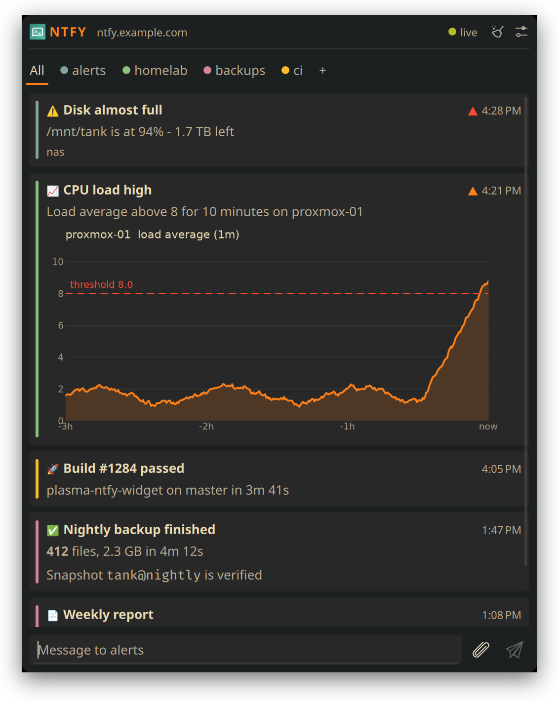

<div align="center">


# ntfy for KDE Plasma

Your [ntfy](https://ntfy.sh) topics in the Plasma 6 panel, with notifications and replies.

[](https://store.kde.org/p/2377064)
[](https://kde.org/plasma-desktop/)
[](https://www.qt.io/)
[](LICENSE)



</div>

## Install

Needs Plasma 6, the Qt 6 WebSockets QML module, and `curl` 7.76+ for file uploads.

From the [KDE Store](https://store.kde.org/p/2377064): right-click the panel -> **Add Widgets** ->
**Get New Widgets** -> **Download New Plasma Widgets**, then search for "ntfy".

From source:

```bash
git clone https://github.com/k-o-n-t-o-r/plasma-ntfy-widget.git
cd plasma-ntfy-widget
./install.sh   # restarts plasmashell
```

Then right-click the panel -> **Add Widgets** -> **ntfy**.

<details>
<summary>Install without restarting Plasma</summary>

```bash
zip -r ntfy.plasmoid metadata.json LICENSE contents
kpackagetool6 -t Plasma/Applet -i ntfy.plasmoid   # -u to update
```

Zip only these files, not the whole checkout.

</details>

## Settings

- **Server:** `ntfy.example.com` is enough, HTTPS is assumed
- **Topics:** comma separated, in tab order
- **Login:** username + password, or an access token (the token wins)
- **Desktop notifications:** on by default

## Good to know

- Credentials are stored **unencrypted** in the Plasma config. Use a restricted access token.
- The WebSocket sends credentials as a base64 `auth` query parameter. Keep query strings
  out of proxy logs.
- History lives in memory only (200 messages). After a Plasma restart the widget reloads
  what the server still caches (12h by default).
- Image previews load from URLs in the messages, which can be third-party hosts.
- A send that times out after 60 s may still have arrived, so retrying can duplicate it.

## Development

```bash
QT_QPA_PLATFORM=offscreen QT_ASSUME_STDERR_HAS_CONSOLE=1 qml6 tests/test_ntfy.qml
node tests/test_runtime.js
python3 tests/test_network.py
python3 tests/test_release.py
```

Tests never contact your ntfy server. `contents/ui/emoji.js` is generated from gemoji's
`db/emoji.json` with `tools/gen-emoji.py`.

## License

[GPL-3.0-or-later](LICENSE). Bundled emoji data (MIT) and ntfy artwork (Apache-2.0):
[THIRD_PARTY_NOTICES](contents/THIRD_PARTY_NOTICES.md). Not an official ntfy or KDE project.

## Disclaimer

This project was developed with the assistance of AI tools. AI was used for tasks such as code generation, refactoring, debugging, documentation, reverse engineering and general development support.
